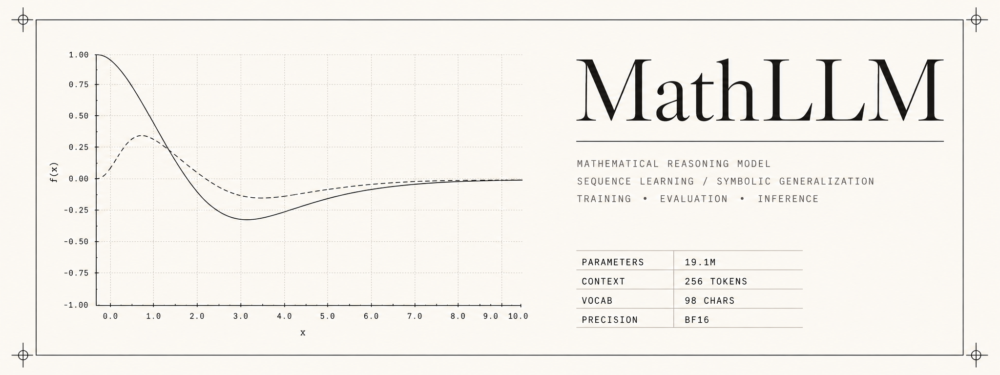
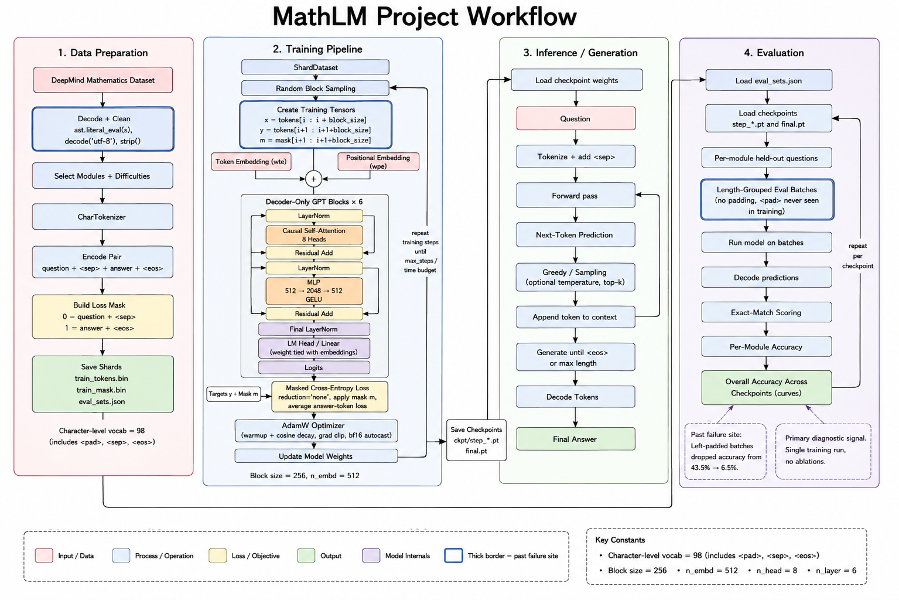

# MathLLM

An 18.9M parameter character-level transformer trained from scratch on the DeepMind Mathematics Dataset. 45 minutes on one laptop GPU. No `transformers`, no `lightning`, no config framework. The tokenizer, data pipeline, model, training loop and evaluation harness are all hand-written.

---

## Why

I kept reading about language models and kept not really understanding them. I could follow an explanation of attention while I was reading it and lose it an hour later. Papers made sense in the moment and then went fuzzy. That is the difference between recognising something and knowing it.

So I built one end to end. Not a fine-tune, not a wrapper around somebody's API. Every piece. If I could not write it, I did not understand it.

Maths was the right first subject. Answers are exactly right or exactly wrong, so scoring is trivial and there is nothing to argue about. There is a large clean dataset. And the tasks arrive pre-sorted into categories, which mattered more than I expected: because I could measure accuracy separately on each one, I could watch the model succeed at some and fail at others, and the pattern in what it failed at turned out to be the most interesting thing here.

This README covers the mistakes as well as the results. The mistakes taught me more.

---

## What it does

It answers maths questions phrased exactly the way the DeepMind dataset phrases them.

```
What is the first derivative of 13*a**2 - 627434*a + 1191410?  ->  26*a - 627434
Sort 53, -2.2, -3, 14, 36 in increasing order.                 ->  -3, -2.2, 14, 36, 53
What is the hundred thousands digit of 82923295?               ->  9
```

It is not a chat model. It saw one format during training, `question<sep>answer<eos>`, and nothing else. Free-form phrasing produces garbage. That is not a bug, it is the direct consequence of training on a single templated distribution, and it is worth seeing for yourself.

---

## Model

| | |
|---|---|
| Parameters | 18,930,176 |
| Layers | 6 |
| Heads | 8 |
| Embedding dimension | 512 |
| Context | 256 characters |
| Vocabulary | 98 (95 printable ASCII plus `<pad>`, `<sep>`, `<eos>`) |
| Attention | FlashAttention via `F.scaled_dot_product_attention` |
| Normalisation | pre-norm LayerNorm, no bias |
| Weight tying | input embedding shared with output projection |

Standard decoder-only stack, nothing novel:

```
tokens -> token embedding + position embedding
       -> [ LayerNorm -> causal self-attention -> add residual
            LayerNorm -> MLP (512 -> 2048 -> 512, GELU) -> add residual ] x 6
       -> LayerNorm
       -> linear projection to vocabulary
```



Three choices worth explaining:

**Character level, not BPE.** The model never sees "differentiate" as one unit, it sees `d`, `i`, `f`, `f`. This is wasteful of context and I would not choose it for a general text model. For maths it buys something real: every number is represented digit by digit, so the model has positional resolution over quantities that a subword vocabulary destroys. A tokenizer that maps `347` to a single token has thrown away the fact that the 3 is in the hundreds place.

**Attention via `F.scaled_dot_product_attention`.** One line instead of a hand-written implementation, and it dispatches to FlashAttention on supported hardware. Write the naive version once to understand it, then never again.

**Weight tying.** The embedding maps 98 characters into 512 dimensions on the way in, and the same matrix transposed maps back on the way out. Saves parameters, usually helps a little.

---

## Training

| | |
|---|---|
| Steps | 7,386 (schedule completed, not truncated) |
| Tokens | 363M, about 17 passes over 21M |
| Wall clock | 45.2 minutes |
| Hardware | 1x RTX 4060 Laptop, 8.59 GB, sm_89 |
| Throughput | 134,460 tok/s sustained |
| Effective batch | 49,152 tokens (96 x 256 x 2 accumulation) |
| Optimiser | AdamW fused, lr 6e-4 cosine to 6e-5, 300 step warmup |
| Precision | bfloat16 autocast, `torch.compile` |
| Loss | cross entropy masked to answer tokens only |

Only about 14% of tokens are answer tokens. The loss is masked so the model is not rewarded for autocompleting question phrasing. Predicting the question back to itself teaches nothing and just dilutes the gradient.

The step count came from measurement, not a guess. A 15 minute throughput benchmark run to thermal equilibrium (86-87C, SM clock stable at 1920-2100 MHz) gave 134,460 tok/s, and `max_steps` was set from that. Predicted 45 minutes, actual 45.2.

That benchmark length matters. Throughput measured in the first 20 seconds of a run is optimistic on a laptop GPU because the chip has not heated up yet. Plan off that number and you come up short.

---

## Results

Exact string match on 200 held-out questions per module, final checkpoint.

| Module | Accuracy | Regime |
|---|---|---|
| `numbers__place_value` | 96.5% | solved |
| `calculus__differentiate` | 86.0% | solved |
| `comparison__sort` | 85.5% | solved |
| `arithmetic__add_or_sub` | 62.0% | still improving at deadline |
| `arithmetic__div` | 53.0% | still improving at deadline |
| `numbers__gcd` | 33.5% | plateaued |
| `arithmetic__mul` | 29.0% | still improving at deadline |
| `polynomials__evaluate` | 9.0% | barely learned |
| `arithmetic__add_sub_multiple` | 8.5% | barely learned |
| `algebra__linear_1d` | 8.0% | barely learned |
| `arithmetic__mixed` | 1.0% | not learned |
| `numbers__is_prime` | 50.0% | chance, binary output |
| **overall** | **43.5%** | |
| overall excluding `is_prime` | 42.7% | |

Final validation loss 0.339, down from 4.705 at initialisation. That number sounds good and means very little on its own, which is exactly why the table above matters.

Exact match means character-for-character identical. `6*x+2` against a target of `6*x + 2` scores zero.

---

## The finding

**The model learned every task expressible as a fixed-depth transformation and failed every task requiring iterative search.**

The cleanest evidence is `numbers__is_prime`. Across all eight checkpoints it read 50.0, 50.0, 50.5, 54.0, 49.0, 56.0, 49.0, 50.0. Flat for 7,386 steps while every other module climbed. It did not learn primality slowly. It did not learn it at all.

Here is why I think that happens.

The model has 6 blocks and each block does two operations, so every input gets exactly 12 nonlinear transformations and then an answer comes out. Twelve. Always twelve, regardless of the question. There is no loop in a transformer. The `x6` in the diagram is unrolled at build time, not iterated at runtime.

Now compare that against what the tasks need:

`numbers__place_value` at 96.5% means locating a position in a digit string and reading off a character. Two steps of work. Twelve is plenty.

`calculus__differentiate` at 86.0% looks harder and is not. It is pattern rewriting: `a*x**n` becomes `a*n*x**(n-1)`. A fixed transformation on a parsed structure, well within twelve steps.

`numbers__is_prime` is a different kind of problem. To know whether a number is prime you have to try candidate divisors and check each one, and how many you check depends on the input. There is no fixed-depth circuit that does this for arbitrary inputs. So the model does the only available thing, learns the base rate, and guesses.

The two modules side by side over the eight checkpoints:

| Step | `place_value` | `is_prime` |
|---|---|---|
| 1000 | 38.0% | 50.0% |
| 2000 | 65.5% | 50.0% |
| 3000 | 89.0% | 50.5% |
| 4000 | 89.5% | 54.0% |
| 5000 | 91.5% | 49.0% |
| 6000 | 95.0% | 56.0% |
| 7000 | 99.0% | 49.0% |
| 7385 | 96.5% | 50.0% |

Same data, same optimiser, same schedule, same number of gradient steps. The only
thing that differs is the task. Overall accuracy over the same span went 11.9, 20.8,
29.5, 32.6, 37.8, 40.8, 42.3, 43.5.

`comparison__sort` at 85.5% and `numbers__gcd` at 33.5% make the same point from the other direction. Both operate on lists of integers. Sorting is comparison, which is shallow and parallel. GCD needs Euclid's algorithm, which is a loop.

### Failure modes

The wrong answers are more informative than the right ones.

On `gcd(1569427, 657)` the model answers `657`. It has learned the heuristic "when one number is much smaller, the gcd is often that number", which is true whenever the smaller divides the larger. A real shortcut, applied where it does not hold.

On `gcd(464690, 48980)` it answers `2210` against a true `310`. Wrong, but the right order of magnitude. It can estimate the size of a plausible answer without being able to compute it.

Arithmetic shows the character-level signature clearly. `-125266 - 1686191` returns `-1707797` against a true `-1811457`: correct sign, correct digit count, wrong digits in the middle. Meanwhile `-2769526541 - -0.5` comes out exactly right. Alignment and formatting are reliable. Carry propagation is not.

That last pattern is the argument for digit reversal, described under Customising below.

---

## The bug that cost 6.7x

My first evaluation run reported 6.5% accuracy. The training curve looked healthy. Hand-typed generations looked fine. The harness said the model was broken.

The cause: evaluation batched questions together and left-padded the short ones with `<pad>` to make lengths match.

The model had never seen `<pad>`. Not once. It does not appear in the training data. So every batched question began with a run of characters the model had no representation for, and generation degraded badly.

The fix was to stop padding at all. Group questions of similar length into the same batch, so no padding is needed. Same checkpoint, same weights: 6.5% padded, 43.5% unpadded.

**Evaluation conditions have to match training conditions exactly.** Any input at eval time that never occurred at training time is a distribution mismatch, and distribution mismatches fail silently. Nothing raises an exception. The loss looks fine. You just get bad numbers and no explanation.

There was a quieter version of the same problem upstream. Raw records from the dataset arrive double-encoded, as strings containing Python bytes literals. Without `ast.literal_eval(s).decode("utf-8").strip()` you end up training on the literal characters `b`, `'` and `\n` in every example. It trains perfectly happily. It just learns the wrong thing.

Both sites are marked on the diagrams in `docs/assets/` so I do not repeat them.

---

## Layout

```
mathllm/
  __init__.py
  config.py        every hyperparameter, one file
  tokenizer.py     character vocabulary, encode and decode
  data.py          dataset download, cleaning, shard writing
  dataset.py       shard loading, batching, loss mask construction
  model.py         the transformer
  train.py         training loop
  evaluate.py      per-module accuracy
scripts/
  prepare_data.py  build the shards
  preflight.py     sanity checks before committing to a long run
  benchmark.py     sustained throughput measurement
  chat.py          interactive prompt
docs/
  assets/          header and architecture diagrams
```

The library lives in `mathllm/`, the entry points in `scripts/`. `train.py` and
`evaluate.py` sit in the package rather than `scripts/`, so they run as modules.

---

## Running it

```bash
git clone https://github.com/Rekhii/MathLLM.git
cd MathLLM
pip install -r requirements.txt
```

PyTorch with CUDA is the only heavy dependency.

### Prepare data

```bash
python scripts/prepare_data.py
```

Downloads from Hugging Face, cleans the double-encoding, builds the character vocabulary, encodes, and writes shards. Runs once and takes a while.

One gotcha: `datasets` 5.0.1 broke script-based dataset loading, so the pipeline pulls from the parquet conversion branch instead. If you hit a loading error mentioning scripts, that is why.

Also worth knowing: in the train split, difficulty levels are concatenated in order rather than labelled with a column. If you want easy only, you slice by position, not by filter.

### Check before you commit

```bash
python scripts/preflight.py
```

Run it every time. Tensor shapes, tokenizer round-trip, one forward and backward pass, an out-of-memory probe at your configured batch size. Ten seconds, and it has caught a broken config before a multi-hour run more than once.

```bash
python scripts/benchmark.py
```

Let it run at least ten minutes so the GPU reaches thermal equilibrium. It logs `clocks.sm` alongside throughput so you can see throttling happen rather than guess at it. Use the sustained number to set `max_steps`.

### Train

```bash
python -m mathllm.train
```

`--max_minutes` caps wall clock directly, `--run_dir` sets the output folder, `--resume` continues from `last.pt`.

Checkpoints land in `runs/<run_dir>/ckpt/`. Keep all of them. Per-module accuracy across checkpoints is the most useful diagnostic in this project and you can only build it if the intermediate weights survive.

`step_*.pt` are weights only, about 76MB each. `final.pt` and `last.pt` also carry optimiser state so training can resume, which puts them at about 228MB.

### Evaluate

```bash
python -m mathllm.evaluate                                   # sweeps every checkpoint
python -m mathllm.evaluate --ckpt runs/run_001/ckpt/final.pt # one checkpoint
```

Sweeping is the default. Results are written to `runs/<run_dir>/per_module_accuracy.json`.

### Generate

```bash
python scripts/chat.py
```

It defaults to `runs/run_001/ckpt/final.pt`. Inside the prompt, `help` shows a sample
question from each module and `test <module>` runs five held-out questions with the
expected answer beside the generated one.

Or from code. The checkpoint is a raw `state_dict`, not a `transformers` model. You need `model.py`, `config.py` and `tokenizer.py`.

```python
import torch
from mathllm.config import Config
from mathllm.model import GPT
from mathllm.tokenizer import CharTokenizer

cfg = Config(); cfg.compile = False
tok = CharTokenizer()
model = GPT(cfg).to(cfg.device)
model.load_state_dict(torch.load("runs/run_001/ckpt/final.pt", map_location=cfg.device)["model"])
model.eval()

def ask(question, max_new_tokens=48):
    ids = tok.encode(question) + [tok.SEP]
    idx = torch.tensor([ids], device=cfg.device)
    with torch.no_grad(), torch.autocast("cuda", dtype=torch.bfloat16):
        out = model.generate(idx, max_new_tokens=max_new_tokens,
                             eos_id=tok.EOS, greedy=True)
    gen = out[0, len(ids):].tolist()
    if tok.EOS in gen:
        gen = gen[:gen.index(tok.EOS)]
    return "".join(tok.itos[i] for i in gen)

print(ask("What is the first derivative of 13*a**2 - 627434*a + 1191410?"))
```

Two rules for generation. Use batch size 1, or group prompts by identical length, for the padding reason above. And decode greedily: there is one correct answer to an arithmetic question, so sampling is strictly worse.

---

## Customising

Everything lives in `config.py`.

**Size.** `n_layer`, `n_head`, `n_embd`. Given the depth argument above, adding layers is more likely to help than widening, though it will not rescue the iterative tasks. Keep `n_embd` divisible by `n_head`.

**Context.** `block_size`. Attention memory grows with the square of this, so raising it is expensive. 256 is comfortable for this dataset. Check your longest example before changing it.

**Data.** Edit the module list. The pipeline does not care what the questions are about, so any question-and-answer dataset works if you keep the `question<sep>answer<eos>` format.

**Batch size.** Raise until `preflight.py` fails its out-of-memory probe, then back off. If you cannot fit what you want, use gradient accumulation.

**Digit reversal.** Not implemented, and the change I would try next. The idea: reverse the digits of integer answers during training, so `472` is written `274`. The model generates left to right, so it currently has to commit to the most significant digit before working out the carries beneath it, which is backwards from how addition actually resolves. Reversing lets it emit ones, then tens, then hundreds, in the order the arithmetic naturally goes. The `-1707797` against `-1811457` failure above is exactly the signature this targets.

If you try it, apply it to only some of the arithmetic modules and leave the others alone. Then the comparison lives inside a single run and you do not need an ablation you cannot afford. Skip division, where answers are often fractions and reversal is meaningless. And remember to invert the transform on the eval side, or you will reproduce the padding bug in a new costume.

---

## Limitations

**Iterative tasks are out of reach.** Primality, factorization, and largely GCD. This is architectural. More training will not fix it.

**Data was repeated, not extended.** About 17 passes over 21M tokens rather than one pass over 363M. Chinchilla-optimal for this parameter count is roughly 380M tokens, so the run was compute-matched but data-repeated. Some of the reported accuracy may be memorisation. The held-out eval set bounds that but does not eliminate it.

**Easy and medium only.** Hard splits were excluded.

**Three modules were still climbing when the clock ran out.** `add_or_sub`, `div` and `mul` were gaining roughly 5 points per 1,000 steps at the end. Those numbers are a floor, not a ceiling.

**Exact match is harsh.** Some fraction of the middle-band failures are formatting rather than mathematics. I tested one version of this on the division module, grouping results by question phrasing to see whether certain formats dragged the average down, and it did not hold up. I have not ruled it out generally.

**One run, no ablations.** Every claim about *why* something happened is inference from a single run. The per-module accuracy across checkpoints is the closest thing to a controlled signal available, since all modules share identical training conditions and only the task varies.

**Character tokenization is wasteful.** A proper BPE vocabulary would fit three or four times as much text in the same 256-token window.

**It does not know what numbers mean.** It has learned the surface patterns of arithmetic notation well enough to often emit the right characters. That is not understanding quantity, and the edges show up quickly outside the template distribution.

---

## Next

- Longer run on the full data. Roughly 700M tokens are available and I used a fraction.
- The digit reversal experiment above.
- A BPE tokenizer, probably as a separate project on a text dataset first, so the tokenization question is isolated from everything else.
- A scratchpad. If the depth argument holds, letting the model write intermediate working before the final answer should help on exactly the tasks it currently fails, because generated text becomes a form of iteration that a fixed-depth forward pass cannot provide on its own. This is the one I most want to run.

---

## Credits

Dataset: [DeepMind Mathematics Dataset](https://github.com/google-deepmind/mathematics_dataset).

The architecture is a small GPT and owes an obvious debt to Andrej Karpathy's nanoGPT, which I read closely while working out how the pieces fit.

Weights and artefacts: [huggingface.co/rekhi/nanomath](https://huggingface.co/rekhi/nanomath), including `metrics.csv` (per-step loss, lr, throughput, GPU temperature, SM clock), `per_module_accuracy.csv` (all eight checkpoints) and `throughput_4060.csv` (the thermal benchmark).

## Licence

MIT.